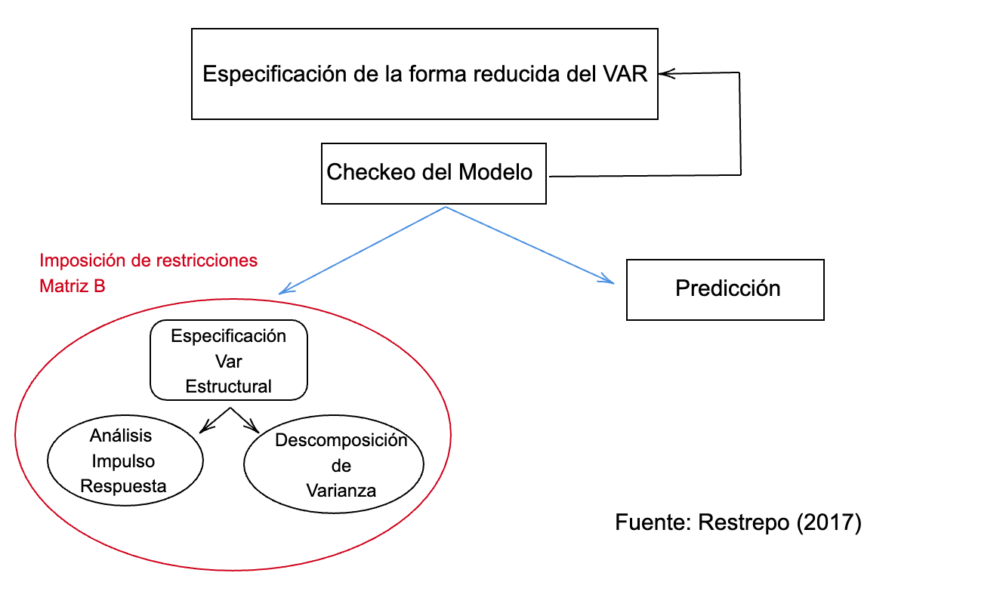

```{r xaringan-themer, include=FALSE, warning=FALSE}
library(xaringanthemer)
style_mono_accent(
  base_color = "#23395b",
  header_font_google = google_font("Josefin Sans"),
  text_font_google   = google_font("Montserrat", "300", "300i"),
  code_font_google   = google_font("Fira Mono")
)
```

```{r, setup, include = F}
# devtools::install_github("dill/emoGG")
library(pacman)
p_load(readr, xts, astsa, fpp2,
  broom, tidyverse,
  latex2exp, ggplot2, ggthemes, ggforce, viridis, extrafont, gridExtra,
  kableExtra, snakecase, janitor, TSstudio, urca, forecast,
  data.table, dplyr, estimatr,
  lubridate, knitr, parallel,
  lfe, emoGG,
  here, magrittr, fontawesome, shiny, babynames
)
# Define pink color
red_pink <- "#e64173"
turquoise <- "#20B2AA"
orange <- "#FFA500"
red <- "#fb6107"
blue <- "#2b59c3"
green <- "#8bb174"
grey_light <- "grey70"
grey_mid <- "grey50"
grey_dark <- "grey20"
purple <- "#6A5ACD"
slate <- "#314f4f"
met_slate <- "#272822"
# Dark slate grey: #314f4f
# Opciones
opts_chunk$set(
  comment = "#>",
  fig.align = "center",
  fig.height = 7,
  fig.width = 10.5,
  warning = F,
  message = F
)
opts_chunk$set(dev = "svg")
options(device = function(file, width, height) {
  svg(tempfile(), width = width, height = height)
})
options(crayon.enabled = F)
options(knitr.table.format = "html")
# A blank theme para ggplot
theme_empty <- theme_bw() + theme(
  line = element_blank(),
  rect = element_blank(),
  strip.text = element_blank(),
  axis.text = element_blank(),
  plot.title = element_blank(),
  axis.title = element_blank(),
  plot.margin = structure(c(0, 0, -0.5, -1), unit = "lines", valid.unit = 3L, class = "unit"),
  legend.position = "none"
)
theme_simple <- theme_bw() + theme(
  line = element_blank(),
  panel.grid = element_blank(),
  rect = element_blank(),
  strip.text = element_blank(),
  axis.text.x = element_text(size = 18, family = "STIXGeneral"),
  axis.text.y = element_blank(),
  axis.ticks = element_blank(),
  plot.title = element_blank(),
  axis.title = element_blank(),
  # plot.margin = structure(c(0, 0, -1, -1), unit = "lines", valid.unit = 3L, class = "unit"),
  legend.position = "none"
)
theme_axes_math <- theme_void() + theme(
  text = element_text(family = "MathJax_Math"),
  axis.title = element_text(size = 22),
  axis.title.x = element_text(hjust = .95, margin = margin(0.15, 0, 0, 0, unit = "lines")),
  axis.title.y = element_text(vjust = .95, margin = margin(0, 0.15, 0, 0, unit = "lines")),
  axis.line = element_line(
    color = "grey70",
    size = 0.25,
    arrow = arrow(angle = 30, length = unit(0.15, "inches")
  )),
  plot.margin = structure(c(1, 0, 1, 0), unit = "lines", valid.unit = 3L, class = "unit"),
  legend.position = "none"
)
theme_axes_serif <- theme_void() + theme(
  text = element_text(family = "MathJax_Main"),
  axis.title = element_text(size = 22),
  axis.title.x = element_text(hjust = .95, margin = margin(0.15, 0, 0, 0, unit = "lines")),
  axis.title.y = element_text(vjust = .95, margin = margin(0, 0.15, 0, 0, unit = "lines")),
  axis.line = element_line(
    color = "grey70",
    size = 0.25,
    arrow = arrow(angle = 30, length = unit(0.15, "inches")
  )),
  plot.margin = structure(c(1, 0, 1, 0), unit = "lines", valid.unit = 3L, class = "unit"),
  legend.position = "none"
)
theme_axes <- theme_void() + theme(
  text = element_text(family = "Fira Sans Book"),
  axis.title = element_text(size = 18),
  axis.title.x = element_text(hjust = .95, margin = margin(0.15, 0, 0, 0, unit = "lines")),
  axis.title.y = element_text(vjust = .95, margin = margin(0, 0.15, 0, 0, unit = "lines")),
  axis.line = element_line(
    color = grey_light,
    size = 0.25,
    arrow = arrow(angle = 30, length = unit(0.15, "inches")
  )),
  plot.margin = structure(c(1, 0, 1, 0), unit = "lines", valid.unit = 3L, class = "unit"),
  legend.position = "none"
)
theme_set(theme_gray(base_size = 20))
# Nombres de las columnas para la regresión
reg_columns <- c("Term", "Est.", "S.E.", "t stat.", "p-Value")
# Formato de p valores
format_pvi <- function(pv) {
  return(ifelse(
    pv < 0.0001,
    "<0.0001",
    round(pv, 4) %>% format(scientific = F)
  ))
}
format_pv <- function(pvs) lapply(X = pvs, FUN = format_pvi) %>% unlist()
# Tidy regression results table
tidy_table <- function(x, terms, highlight_row = 1, highlight_color = "black", highlight_bold = T, digits = c(NA, 3, 3, 2, 5), title = NULL) {
  x %>%
    tidy() %>%
    select(1:5) %>%
    mutate(
      term = terms,
      p.value = p.value %>% format_pv()
    ) %>%
    kable(
      col.names = reg_columns,
      escape = F,
      digits = digits,
      caption = title
    ) %>%
    kable_styling(font_size = 20) %>%
    row_spec(1:nrow(tidy(x)), background = "white") %>%
    row_spec(highlight_row, bold = highlight_bold, color = highlight_color)
}
# A few extras
xaringanExtra::use_xaringan_extra(c("tile_view", "fit_screen"))
xaringanExtra::use_clipboard()
xaringanExtra::use_share_again()
xaringanExtra::style_share_again(
  share_buttons = c("twitter", "linkedin", "pocket")
)
```

name: xaringan-title
class: inverse, left, bottom
background-image: url(pictures/picuniform.jpg)
background-size: cover

# **`r rmarkdown::metadata$title`**
----

## **`r rmarkdown::metadata$subtitle`**

### `r rmarkdown::metadata$author`
### `r rmarkdown::metadata$date`

```{r xaringanExtra-share-again, echo=FALSE}
xaringanExtra::use_share_again()
```
---
class: inverse, middle, center

# Preguntas de las sesiones anteriores?

---
background-size: 100%
background-image: url(https://media.giphy.com/media/E3cX3sxRHMZWM/giphy.gif)

---
layout: true
# Modelos VAR

---

--

### Justificación

--

`r fa("info-circle", fill="red")` Las regresiones en series de tiempo como se vio en econometría I, pueden estar marcadas por la doble simultaneidad o retroalimentación entre las variables usadas, generando sesgos en los **coeficientes**.

--

`r fa("info-circle", fill="red")` Los modelos de .hi[vectores auto-regresivos] (VAR) fueron desarrollados a partir de la critica de **Sims** a los modelos macroeconómicos que no identificaban la existencia de relaciones exógenas y endógenas entre las variables.

--

### Para que sirve un VAR

--

- Como el pasado afecta el presente de las variables y si una variable puede ser útil para pronosticar otra (causalidad de Granger)

- Analizar las .hi-purple[relaciones dinámicas] basadas en **efectos contemporáneos** e .hi[impulsos respuesta] 

- Pronósticos 

---

--

```{r, out.width="70%", fig.cap="Figura 1: Estructura de Modelamiento", echo=FALSE}

```

---

--

`r fa("mug-hot", fill="red")` Los .hi[modelos VAR] parten de una forma *estructural* o primitiva que requiere ser transformada o volver una forma reducida.

--

`r fa("mug-hot", fill="red")` En principio se muestra un sistema de ecuaciones con dos variables: PIB $(Y_t)$ y Tasa de interés $(X_t)$ que se retroalimentan. Si se asume un modelo VAR(1), entonces:

--

Considere un modelo bivariado $(Y_{t}, X_{t})$ y de primer orden:

$$Y_{t}= \beta_{10} - \beta_{11} X_{t} + \gamma_{11} Y_{t-1}+\gamma_{12} X_{t-1}+ \epsilon_{yt}$$
$$X_{t}= \beta_{20} - \beta_{21} Y_{t} + \gamma_{21} Y_{t-1}+\gamma_{22} X_{t-1}+ \epsilon_{xt}$$

--

Donde

--

- Tanto X y Y son endógenas.
- Los términos de error del modelo $(\epsilon_{yt}, \epsilon_{xt}) \sim \; R.B (0, \sigma^{2})$.
- .hi[Habría] que estimar 10 términos (8 parámetros y dos desviaciones del error de cada variable .hi-purple[endogena]).

---

--

### Modelo en forma estructural

--

$$Y_{t}= \beta_{10} - \beta_{11} X_{t} + \gamma_{11} Y_{t-1}+\gamma_{12} X_{t-1}+ \epsilon_{yt}$$
$$X_{t}= \beta_{20} - \beta_{21} Y_{t} + \gamma_{21} Y_{t-1}+\gamma_{22} X_{t-1}+ \epsilon_{xt}$$

--

Tenemos que:

--

- $\beta_{11}$ es el .hi[efecto contemporáneo] de una unidad de cambio de $X_t$ sobre $Y_t$
- $\beta_{21}$ es el .hi[efecto contemporáneo] de una unidad de cambio de $Y_t$  sobre $X_t$
- $\gamma_{12}$  y $\gamma_{12}$ son los .hi-purple[efectos de los rezagos] de $Y_t$ y $X_t$ sobre $Y_t$ 
- $\gamma_{21}$  y $\gamma_{22}$ son los .hi-purple[efectos de los rezagos] de $Y_t$ y $X_t$ sobre $X_t$

--

Si $\beta_{11}$ no es cero, $\varepsilon_{rt}$ tiene un efecto contemporáneo indirecto sobre $Y_t$. Es decir, un choque en $X_t$ afecta a $Y_t$.

--

Las ecuaciones del sistema no se pueden estimar por .hi-purple[MCO] debido a la existencia de esos efectos contemporáneos $\beta_{11}$ y $\beta_{21}$ que generan .hi[endogeneidad] por doble causalidad, lo que lleva a tener .hi-purple[estimadores] **sesgados**.

---

--

## VAR FORMA ESTRUCTURAL

--

$$\underbrace{\begin{pmatrix}
1 & \beta_{12} \\ 
\beta_{21} & 1 
\end{pmatrix}}_{B}
\underbrace{\begin{pmatrix}
Y_t\\ 
X_t
\end{pmatrix}}_{X_t}
=
\underbrace{\begin{pmatrix}
\beta_{10}\\ 
\beta_{20}
\end{pmatrix}}_{G_0}
+
\underbrace{\begin{pmatrix}
\gamma_{11} & \gamma_{12} \\ 
\gamma_{21} & \gamma_{22} 
\end{pmatrix}}_{G_1}
\underbrace{\begin{pmatrix}
Y_{t-1}\\ 
X_{t-1}
\end{pmatrix}}_{X_{t-1}}
+
\underbrace{\begin{pmatrix}
\varepsilon_{yt}\\ 
\varepsilon_{xt}
\end{pmatrix}}_{\varepsilon_t}$$

--

Desde luego podemos establecer un modelo .hi[estructural] de tal forma que:

--

$$BX_t=G_0+G_1X_{t-1}+\varepsilon_{t}$$

--

La forma estructural da para .hi-purple[10] parámetros, lo que es 8 coeficientes y dos varianzas de los errores $\sigma_{\varepsilon y}$ y $\sigma_{\varepsilon x}$

--

Note que la diagonal de la matriz de covarianza es igual a (1), la razón es que se 
normalizó - *es un criterio que se impone*

---

--

### Demostración de la parte de (normalización):

--

- Cuando se habla de .hi[identificación] del VAR se hace alusión a la imposición de .mono[restricciones] o .hi-red[condiciones] para poder estimar unos parámetros.

--

- Veamos esto con un ejemplo más *ilustrativo*, olvidemos por un momento que hablamos de VAR. Tenemos una ecuación cualquiera dada por:

--

$$AX-BY=0$$
- Tenemos en esta ocasión encontrar (2) parámetros (A y B).

--

$$Y=\dfrac{AX}{B}$$

--

- Si reducimos la expresión tendremos: $C=\dfrac{A}{B}$, pero eso nos da:

--

$$Y=CX$$


---

--

- El problema de $Y=CX$, es que apenas hemos encontrado un .mono[parámetro] y es lo mismo que ocurre con los modelos **VAR**.

--

- Corresponde entonces establecer restricciones para poder estimarlo correctamente

---

--

### Prueba VAR representación matricial (un parentesis):

--

`r fa("fighter-jet", fill="red")` *En algunas ocasiones* puede preguntarse como puedo demostrar que en realidad es un modelo VAR.

--

$$\begin{pmatrix}
1 & \beta_{12} \\ 
\beta_{21} & 1 
\end{pmatrix}\begin{pmatrix}
Y_t\\ 
X_t
\end{pmatrix}=\begin{pmatrix}
1\times Y_t + \beta_{12}X_{t} \\ 
\beta_{21} Y_t + 1\times X_{t} 
\end{pmatrix} \longrightarrow \; \begin{align*}
Y_t &=- \beta_{12}X_t \\ 
X_t &=- \beta_{21}Y_t 
\end{align*}$$

--

Desde luego tenemos para la siguiente parte:

--

$$\begin{pmatrix}
\gamma_{11} & \gamma_{12} \\ 
\gamma_{21} & \gamma_{22} 
\end{pmatrix}\begin{pmatrix}
Y_{t-1}\\ 
X_{t-1}
\end{pmatrix}=\begin{pmatrix}
\gamma_{11} Y_{t-1} + \gamma_{12}X_{t-1} \\ 
\gamma_{21} Y_{t-1} + \gamma_{22}X_{t-1} 
\end{pmatrix}$$


---

--

`r fa("palette", fill="red")` A partir de la forma estructural del VAR cuya ecuación viene siendo: $BX_t=G_0+G_1X_{t-1}+\varepsilon_{t}$, se puede estimar una forma .hi[reducida], para ello se **premultiplica** la matriz $B^{-1}$ (matriz inversa) en ambos lados de la ecuación, de tal forma que:

--

$$\underbrace{B^{-1} B}_{I}X_t=\underbrace{B^{-1}G_0}_{A_0}+\underbrace{B^{-1}G_1}_{A_1} X_{t-1}+\underbrace{B^{-1}\varepsilon_{t}}_{e_t}$$

--

De esta manera se obtiene una forma .hi[reducida] de tal forma que: $X_t=A_0+A_1X_{t-1}+e_t$, donde $e_t$ es el error .hi-purple[reducido] y cumple con:

--

- $E[e_t]=0$
- $E[e_t, e_t']=\Sigma$

--

`r fa("info-circle", fill="red")` La matriz $\Sigma$ no es mas que la matriz de varianzas y covarianzas para esta forma reducida con tres (3) parámetros $(\sigma_y^2, \sigma_x^2, \sigma_{yx}^2)$

--

Lo que es: 
$$\Sigma=\begin{pmatrix}
 \sigma_{y}^{2}&\sigma_{yx}^{2} \\ 
 \sigma_{yx}^{2}&\sigma_{x}^{2} 
\end{pmatrix}$$

---

--

La forma reducida del VAR $X_t=A_0+A_1X_{t-1}+e_t$, tambien puede verse como:

$$X_t=\begin{Bmatrix}
Y_t\\ 
X_t
\end{Bmatrix},
A_0=\begin{Bmatrix}
a_{10}\\ 
a_{20}
\end{Bmatrix},
A_1=\begin{Bmatrix}
a_{11}&a_{12}\\ 
a_{21}&a_{22}
\end{Bmatrix},
e_t=\begin{Bmatrix}
e_y\\ 
e_x
\end{Bmatrix}$$

--

Todas tamaño de $n\times 1$ con exepción de $A_1$, que viene a ser $n\times n$. Lo anterior podemos expresarlo como:

--

$$\begin{aligned}
Y_t=&a_{10}+a_{11}Y_{t-1}+a_{12}X_{t-1}+e_{yt}\\
X_t=&a_{20}+a_{21}Y_{t-1}+a_{22}X_{t-1}+e_{xt}
\end{aligned}$$

--

De esta forma .hi[reducida], observe que no hay .hi-purple[efectos contemporáneos] directos tal como $\beta_{11}$ y $\beta_{21}$, sin embargo no estan eliminados, estan dentro del residuo $\color{red}{e_t}$.

--

En esta forma, solo se cuentan .hi[9] parámetros: seis (6) coeficientes, una (1) covarianza y dos (2) varianzas respectivamente. Los errores en la forma .hi[reducida]
tienen relación los errores.

---

--

Cuando se tiene la opción reducida del VAR, tenemos un resultado importante:

--

$$e_t=B^{-1}\varepsilon_t$$

--

- $\varepsilon_t$ es el error de forma .hi-slate[estructural]
- $e_t$ es el error de forma .hi-pink[reducida].

--

*Con la forma reducida si se puede vía MCO y ademas se pueden hacer los pronosticos*.

--

De esta forma .hi[reducida] no se modelan las relaciones .hi-slate[contemporáneas] entre variables, esto requiere de los modelos estructurales y de la identificación del VAR.

---
layout: false
class: middle, inverse, center

# Identificación del VAR 

---
layout: true
# Identificación del VAR

---

--

Cuando se habla de **identificación** del VAR se hace alusión a la imposición de *restricciones* o .hi-purple[condiciones] para poder estimar unos parámetros. Recuerque que habiamos hecho algo de:

--

$$AX-BY=0$$

--

Esa es una .hi[relación estructural] y queremos conocer cuanto valen A y B (2 parámetros). 

--

Ahora se despeja $Y$, al hacerlo se puede hablar de obtener una forma reducida (esto ya es una forma funcional, más que una relación).

--

$Y=AX/ B$ y ademas $A/B=C$, así la forma reducida queda $Y=CX$. Si se corriera una regresión, se podría hallar el parámetro C, es decir, un (1) parámetro.

--

Nuestro objetivo inicial era encontrar A y B (2 parámetros), pero con la forma reducida solo encontramos C (1 parámetro).

--

El problema anterior es el mismo que se presenta en VAR, no se pueden encontrar A y B (en forma estructural). Por ello debe ponerse una restricción o condición. Por ejemplo que $B=1$, Así $A/B=C$, $A/1=C$, $A=B!$

---

--

- La .hi[identificación] del VAR permitirá revelar las relaciones entre las variables y su dinámica, de esto se trata.

--

- En el caso de la relación entre PIB $(Y_t)$ y la Tasa de interés $(X_t)$, se sabe que los Bancos centrales modifican la .hi-orange[tasa de interés] ante los datos observados de PIB, de esta manera, si se reporta un dato de **crecimiento negativo** entonces se procede a bajar la tasa de interés. Ahora bien, esa reducción de la tasa de interés no afectará el PIB inmediatamente.

--

- Frente a lo anterior, por un lado se puede concluir que el **PIB** afecta contemporáneamente y con rezagos a la .hi-slate[tasa de interés].

--

Por otro lado, se entiende que solo los rezagos de la tasa de interés afectan al PIB, es decir no hay efecto contemporáneo. 

---
$$\underbrace{\begin{pmatrix}
1 & \beta_{12} \\ 
\beta_{21} & 1 
\end{pmatrix}}_{B}
\underbrace{\begin{pmatrix}
Y_t\\ 
X_t
\end{pmatrix}}_{X_t}
=
\underbrace{\begin{pmatrix}
\beta_{10}\\ 
\beta_{20}
\end{pmatrix}}_{G_0}
+
\underbrace{\begin{pmatrix}
\gamma_{11} & \gamma_{12} \\ 
\gamma_{21} & \gamma_{22} 
\end{pmatrix}}_{G_1}
\underbrace{\begin{pmatrix}
Y_{t-1}\\ 
X_{t-1}
\end{pmatrix}}_{X_{t-1}}
+
\underbrace{\begin{pmatrix}
\varepsilon_{yt}\\ 
\varepsilon_{xt}
\end{pmatrix}}_{\varepsilon_t}$$

--

Si implantamos una restricción en el efecto contemporáneo, entonces vamos a tener

--

$$\underbrace{\begin{pmatrix}
1 & \color{red}{0} \\ 
\beta_{21} & 1 
\end{pmatrix}}_{B}
\underbrace{\begin{pmatrix}
Y_t\\ 
X_t
\end{pmatrix}}_{X_t}
=
\underbrace{\begin{pmatrix}
\beta_{10}\\ 
\beta_{20}
\end{pmatrix}}_{G_0}
+
\underbrace{\begin{pmatrix}
\gamma_{11} & \gamma_{12} \\ 
\gamma_{21} & \gamma_{22} 
\end{pmatrix}}_{G_1}
\underbrace{\begin{pmatrix}
Y_{t-1}\\ 
X_{t-1}
\end{pmatrix}}_{X_{t-1}}
+
\underbrace{\begin{pmatrix}
\varepsilon_{yt}\\ 
\varepsilon_{xt}
\end{pmatrix}}_{\varepsilon_t}$$

---

--

Lo que ahora nos da un sistema de tal manera que:

--

$$\begin{aligned}
Y_t=&\beta_{10}+\gamma_{11}Y_{t-1}+\gamma_{12}X_{t-1}+\varepsilon_{yt}\\
X_t=&\beta_{20}-\beta_{21}Y_t+\gamma_{21}Y_{t-1}+\gamma_{22}X_{t-1}+\varepsilon_{xt}
\end{aligned}$$

--

Asi, que de forma estructural tendrá (9) parámetros, que es lo mismo con la forma .hi[reducida].

--

Es claro que una matriz con una restricción:

$$B=\begin{pmatrix}1&\color{red}{0}\\
\beta_{21} & 1
\end{pmatrix}$$

--

También cambiará la estructura de $B^{-1}$ y por ende su forma reducida. La .hi[identificación] permite develar las relaciones entre variables y realizar las impulso respuestas y desde luego descomponer la varianza.

--

Premultiplicando vamos a tener ahora a:

$$B^{-1}BX_t=B^{-1}G_0+B^{-1}G_1X_{t-1}+B^{-1}\varepsilon_t$$

--

esto nos lleva a:

---

$$\begin{equation}
\begin{pmatrix}
Y_{t}\\
X_{t}
\end{pmatrix}=
\begin{pmatrix}
1 & 0 \\ 
-\beta_{21} & 1 
\end{pmatrix}
\begin{pmatrix}
\beta_{10}\\ 
\beta_{20}
\end{pmatrix}+
\begin{pmatrix}
1 & 0 \\ 
-\beta_{21} & 1 
\end{pmatrix}\begin{pmatrix}
\gamma_{11} & \gamma_{12}\\ 
\gamma_{21} & \gamma_{22} 
\end{pmatrix}\begin{pmatrix}
Y_{t-1}\\
X_{t-1}
\end{pmatrix}
+\begin{pmatrix}
1 & 0 \\ 
-\beta_{21} & 1 
\end{pmatrix}\begin{pmatrix}
\varepsilon_{yt} \\ 
\varepsilon_{xt}  
\end{pmatrix}
\end{equation}$$

--

Desde luego simplificando lo anterior -esto es resolviendo cada fila con columna-

--

$$\begin{equation}
\begin{pmatrix}
Y_{t}\\
X_{t}
\end{pmatrix}=
\begin{pmatrix}
\beta_{10}  \\ 
-\beta_{21} \beta_{10}+ \beta_{20}  
\end{pmatrix}
+
\begin{pmatrix}
\gamma_{11} & \gamma_{12} \\ 
-\beta_{21} \gamma_{11}+ \gamma_{21}  & -\beta_{21} \gamma_{12}+ \gamma_{22}  
\end{pmatrix}\begin{pmatrix}
Y_{t-1}\\
X_{t-1}
\end{pmatrix}+
\begin{pmatrix}
\varepsilon_{yt} \\ 
-\beta_{21}\varepsilon_{yt}+\varepsilon_{xt}  
\end{pmatrix}
\end{equation}$$

--

Ademas que $e_t$ cambia su forma y esto se traduce en:

--

$$\begin{aligned}
e_{xt}=&-\beta_{21}e_{yt}+ \varepsilon_{xt}\\
e_{xt}+&\beta_{21}e_{yt}= \varepsilon_{xt}
\end{aligned}$$

--

La relación anterior es clave, pues está mostrando que por medio de una combinación lineal de .hi[choques o errores] de la forma .hi[reducida] $(e_{xt}\;y \; e_{yt})$  y el efecto contemporáneo $\beta_{21}$, se recuperan los choques estructurales de la tasa de interés $\varepsilon_{xt}$.

---

--

`r fa("palette", fill="red")` Estimar un VAR de mayor orden, deben imponerse mas restricciones, por lo cual debe tener en cuenta:

--

1. En un VAR estructural, el numero de elementos en la matriz $B$ es $n^2$.

--

2. En un VAR reducido, en $\Sigma$ (matriz de covarianza) incorpora efectos contemporaneos que viene a ser $-\dfrac{n(n+1)}{2}$

--

.hi[.mono[Por ejemplo]:] ¿cuantas restricciones se requieren para los siguientes VAR, uno con 3 variables y otro con 4?

--

.ex[Restricciones]: $\dfrac{n^2-n}{2}=\dfrac{3^2-3}{2}=3$ y para el otro $\dfrac{4^2-4}{2}=6$ 

--

Al igual que ocurría con los modelos ARIMA, si su parte AR tiene .hi-purple[raíces invertibles] menor a 1, es decir se encuentran **dentro** del .hi-slate[circulo unitario], entonces el sistema es estacionario y estable.

--

En el caso de VAR, se dirá que si la matriz polinómica con operador de rezago A(L) es invertible, el VAR es .hi[estacionario] y .hi[estable].

---
layout: false
class: inverse, middle, center

# Continuará...
---
# Bibliografía


`r fa('book')` Rabbi, F., Tareq, S.U., Islam, M.M., Chowdhury, M.A., & Abul Kashem, M. (2020). *A Multivariate Time Series Approach for Forecasting of Electricity Demand in Bangladesh Using ARIMAX Model*. 2020 2nd International Conference on Sustainable Technologies for Industry 4.0 (STI), 1-5.

`r fa('book')` Hyndman, R.J., & Athanasopoulos, G. (2021). *Forecasting: principles and practice*, 3rd edition, OTexts: Melbourne, Australia.

`r fa('book')` Shumway, R., & Stoffer, D. (2019). *Time series: a data analysis approach using R*. CRC Press.

---
name: adios
class: middle

.pull-left[
# **¡Gracias!**
<br/>
## Modelos VAR

### Seguimos aprendiendo
]

.pull-right[
.right[


`r fontawesome::fa("link")` [Syllabus/ Curso](https://pomelo.uninorte.edu.co/pls/prod/bwckctlg.p_disp_course_detail?cat_term_in=202210&subj_code_in=ECO&crse_numb_in=0010)<br/>
`r fontawesome::fa("twitter")` [@keynes37](https://twitter.com/keynes37)<br/>
`r fontawesome::fa("paper-plane")`[ cayanes@uninorte.edu.co](mailto:cayanes@uninorte.edu.co)
]
]


